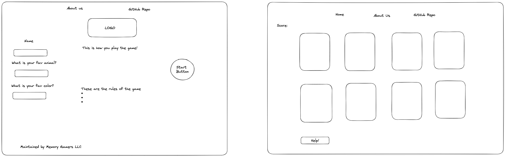

# 201d98 - Memory Game 

## Members:
- Cameron Griffin
- Ryan Apodaca
- Davey Auz
- Stephen Levesque
- Sarah Glass

## Description

**1. Sumamry of Idea**

Goal of the game is to play 8x8 grid. Grid is made of 64 cards total, where each card will be a pair of another card. Once both cards are selected, they will be removed from the grid. User plays until all matches are made.

**2. What problem or pain point does it solve? a. Keep it high level without going into too much detail. (3-4 sentences is enough)**

Helps users practice short term memory.

## Wireframing

## Wireframe & Domain Modeling

